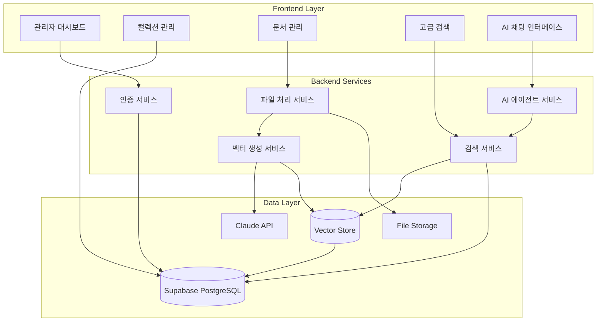

# 벡터 데이터베이스 관리 시스템 설계 문서

## 개요

린코리아 웹사이트에 통합될 벡터 데이터베이스 관리 시스템은 관리자가 문서를 효율적으로 관리하고, AI 에이전트가 RAG 기반으로 정확한 답변을 제공할 수 있도록 하는 종합적인 플랫폼입니다. 기존 Supabase 인프라를 활용하여 확장성과 성능을 보장합니다.

## 아키텍처

### 시스템 아키텍처 다이어그램



### 기술 스택

- **Frontend**: React 18 + TypeScript + Tailwind CSS + Shadcn UI
- **Backend**: Supabase (PostgreSQL + Auth + Storage)
- **Vector Database**: PostgreSQL with pgvector extension
- **AI/ML**: Claude Embeddings API
- **File Processing**: 브라우저 기반 텍스트 추출
- **State Management**: TanStack React Query

## 컴포넌트 및 인터페이스

### 1. 데이터베이스 스키마

#### Collections 테이블
```sql
CREATE TABLE collections (
  id UUID PRIMARY KEY DEFAULT gen_random_uuid(),
  name TEXT NOT NULL,
  description TEXT,
  metadata JSONB DEFAULT '{}',
  created_by UUID REFERENCES auth.users(id),
  created_at TIMESTAMPTZ DEFAULT NOW(),
  updated_at TIMESTAMPTZ DEFAULT NOW(),
  is_active BOOLEAN DEFAULT true,
  document_count INTEGER DEFAULT 0,
  total_chunks INTEGER DEFAULT 0
);
```

#### Documents 테이블
```sql
CREATE TABLE documents (
  id UUID PRIMARY KEY DEFAULT gen_random_uuid(),
  collection_id UUID REFERENCES collections(id) ON DELETE CASCADE,
  filename TEXT NOT NULL,
  original_filename TEXT NOT NULL,
  file_type TEXT NOT NULL,
  file_size BIGINT NOT NULL,
  content TEXT,
  metadata JSONB DEFAULT '{}',
  processing_status TEXT DEFAULT 'pending', -- pending, processing, completed, failed
  error_message TEXT,
  created_by UUID REFERENCES auth.users(id),
  created_at TIMESTAMPTZ DEFAULT NOW(),
  updated_at TIMESTAMPTZ DEFAULT NOW(),
  chunk_count INTEGER DEFAULT 0
);
```

#### Document_Chunks 테이블
```sql
CREATE TABLE document_chunks (
  id UUID PRIMARY KEY DEFAULT gen_random_uuid(),
  document_id UUID REFERENCES documents(id) ON DELETE CASCADE,
  chunk_index INTEGER NOT NULL,
  content TEXT NOT NULL,
  embedding VECTOR(1024), -- Claude embedding dimension
  metadata JSONB DEFAULT '{}',
  created_at TIMESTAMPTZ DEFAULT NOW(),
  
  -- 전문 검색을 위한 인덱스
  CONSTRAINT document_chunks_document_chunk_idx UNIQUE(document_id, chunk_index)
);

-- 벡터 유사도 검색을 위한 인덱스
CREATE INDEX ON document_chunks USING ivfflat (embedding vector_cosine_ops);

-- 전문 검색을 위한 인덱스
CREATE INDEX document_chunks_content_fts_idx ON document_chunks 
USING gin(to_tsvector('korean', content));
```

#### Search_Logs 테이블
```sql
CREATE TABLE search_logs (
  id UUID PRIMARY KEY DEFAULT gen_random_uuid(),
  user_id UUID REFERENCES auth.users(id),
  query TEXT NOT NULL,
  search_type TEXT NOT NULL, -- semantic, keyword, hybrid
  results_count INTEGER,
  execution_time_ms INTEGER,
  created_at TIMESTAMPTZ DEFAULT NOW()
);
```

### 2. API 서비스 레이어

#### 컬렉션 서비스
```typescript
interface CollectionService {
  // CRUD 작업
  createCollection(data: CreateCollectionData): Promise<Collection>;
  getCollections(filters?: CollectionFilters): Promise<Collection[]>;
  getCollectionById(id: string): Promise<Collection>;
  updateCollection(id: string, data: UpdateCollectionData): Promise<Collection>;
  deleteCollection(id: string): Promise<void>;
  
  // 통계 및 메타데이터
  getCollectionStats(id: string): Promise<CollectionStats>;
  updateCollectionMetadata(id: string, metadata: Record<string, any>): Promise<void>;
  
  // 일괄 작업
  bulkDeleteCollections(ids: string[]): Promise<void>;
  bulkUpdateStatus(ids: string[], isActive: boolean): Promise<void>;
}
```

#### 문서 서비스
```typescript
interface DocumentService {
  // 파일 업로드 및 처리
  uploadDocuments(files: File[], collectionId: string): Promise<UploadResult[]>;
  processDocument(documentId: string): Promise<ProcessingResult>;
  
  // CRUD 작업
  getDocuments(collectionId: string, filters?: DocumentFilters): Promise<Document[]>;
  getDocumentById(id: string): Promise<Document>;
  deleteDocument(id: string): Promise<void>;
  
  // 청크 관리
  getDocumentChunks(documentId: string): Promise<DocumentChunk[]>;
  updateChunk(chunkId: string, content: string): Promise<void>;
  
  // 일괄 작업
  bulkDeleteDocuments(ids: string[]): Promise<void>;
  reprocessDocument(documentId: string): Promise<void>;
}
```

#### 검색 서비스
```typescript
interface SearchService {
  // 검색 기능
  semanticSearch(query: string, options: SemanticSearchOptions): Promise<SearchResult[]>;
  keywordSearch(query: string, options: KeywordSearchOptions): Promise<SearchResult[]>;
  hybridSearch(query: string, options: HybridSearchOptions): Promise<SearchResult[]>;
  
  // 필터링
  searchWithFilters(query: string, filters: SearchFilters): Promise<SearchResult[]>;
  
  // 통계
  getSearchStats(): Promise<SearchStats>;
}
```

### 3. 프론트엔드 컴포넌트 구조

```
src/
├── components/
│   └── vector-management/
│       ├── collections/
│       │   ├── CollectionList.tsx
│       │   ├── CollectionForm.tsx
│       │   ├── CollectionStats.tsx
│       │   └── CollectionActions.tsx
│       ├── documents/
│       │   ├── DocumentUpload.tsx
│       │   ├── DocumentList.tsx
│       │   ├── DocumentViewer.tsx
│       │   ├── ChunkViewer.tsx
│       │   └── ProcessingStatus.tsx
│       ├── search/
│       │   ├── SearchInterface.tsx
│       │   ├── SearchResults.tsx
│       │   ├── SearchFilters.tsx
│       │   └── SearchStats.tsx
│       └── shared/
│           ├── LoadingSpinner.tsx
│           ├── ErrorBoundary.tsx
│           └── ConfirmDialog.tsx
├── pages/
│   └── admin/
│       └── VectorManagement.tsx
├── hooks/
│   ├── useCollections.ts
│   ├── useDocuments.ts
│   ├── useSearch.ts
│   └── useVectorAuth.ts
├── services/
│   ├── collectionService.ts
│   ├── documentService.ts
│   ├── searchService.ts
│   └── embeddingService.ts
└── types/
    └── vector.ts
```

## 데이터 모델

### 핵심 타입 정의

```typescript
// 컬렉션 관련 타입
interface Collection {
  id: string;
  name: string;
  description?: string;
  metadata: Record<string, any>;
  created_by: string;
  created_at: string;
  updated_at: string;
  is_active: boolean;
  document_count: number;
  total_chunks: number;
}

// 문서 관련 타입
interface Document {
  id: string;
  collection_id: string;
  filename: string;
  original_filename: string;
  file_type: string;
  file_size: number;
  content?: string;
  metadata: Record<string, any>;
  processing_status: 'pending' | 'processing' | 'completed' | 'failed';
  error_message?: string;
  created_by: string;
  created_at: string;
  updated_at: string;
  chunk_count: number;
}

// 문서 청크 타입
interface DocumentChunk {
  id: string;
  document_id: string;
  chunk_index: number;
  content: string;
  embedding?: number[];
  metadata: Record<string, any>;
  created_at: string;
}

// 검색 결과 타입
interface SearchResult {
  chunk_id: string;
  document_id: string;
  collection_id: string;
  content: string;
  similarity_score?: number;
  rank?: number;
  document_name: string;
  collection_name: string;
  metadata: Record<string, any>;
}
```

## 오류 처리

### 오류 처리 전략

1. **파일 업로드 오류**
   - 지원되지 않는 파일 형식
   - 파일 크기 제한 초과
   - 네트워크 오류

2. **텍스트 추출 오류**
   - 손상된 파일
   - 암호화된 PDF
   - 인코딩 문제

3. **벡터 생성 오류**
   - Claude API 한도 초과
   - 네트워크 타임아웃
   - 텍스트 길이 제한

4. **검색 오류**
   - 데이터베이스 연결 실패
   - 쿼리 타임아웃
   - 잘못된 검색 매개변수

### 오류 복구 메커니즘

```typescript
interface ErrorRecovery {
  // 재시도 로직
  retryWithBackoff<T>(
    operation: () => Promise<T>,
    maxRetries: number,
    backoffMs: number
  ): Promise<T>;
  
  // 부분 실패 처리
  handlePartialFailure(
    results: (SuccessResult | ErrorResult)[],
    onPartialSuccess: (successful: SuccessResult[]) => void,
    onErrors: (errors: ErrorResult[]) => void
  ): void;
  
  // 상태 복구
  recoverProcessingState(documentId: string): Promise<void>;
}
```

## 테스팅 전략

### 단위 테스트
- 각 서비스 함수의 개별 테스트
- 컴포넌트 렌더링 테스트
- 훅 로직 테스트

### 통합 테스트
- API 엔드포인트 테스트
- 데이터베이스 상호작용 테스트
- 파일 업로드 플로우 테스트

### E2E 테스트
- 전체 문서 업로드 및 검색 플로우
- 관리자 권한 확인
- 오류 시나리오 테스트

### 성능 테스트
- 대용량 파일 처리 성능
- 동시 업로드 처리
- 검색 응답 시간

## 보안 고려사항

### 인증 및 권한
- Supabase RLS(Row Level Security) 활용
- 관리자 권한 확인 미들웨어
- API 키 보안 관리

### 데이터 보안
- 파일 업로드 검증
- SQL 인젝션 방지
- XSS 공격 방지

### 개인정보 보호
- 민감한 정보 마스킹
- 로그 데이터 익명화
- GDPR 준수

## 성능 최적화

### 데이터베이스 최적화
- 적절한 인덱스 설정
- 쿼리 최적화
- 연결 풀링

### 프론트엔드 최적화
- 가상화된 리스트
- 지연 로딩
- 캐싱 전략

### 파일 처리 최적화
- 청크 단위 처리
- 워커 스레드 활용
- 진행률 표시

## 확장성 고려사항

### 수평 확장
- 마이크로서비스 아키텍처 준비
- API 버전 관리
- 로드 밸런싱

### 데이터 확장
- 파티셔닝 전략
- 아카이빙 정책
- 백업 및 복구

### 기능 확장
- 플러그인 아키텍처
- 웹훅 지원
- 외부 시스템 연동