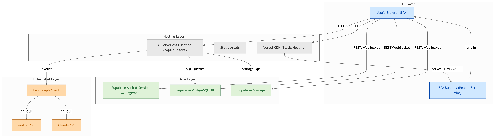

# 🏗️ 린코리아(RIN Korea) 공식 웹사이트

> **친환경 불연재(1액형) 신소재 세라믹 코팅제 전문 기업**  
> 특허 제10-2312833호 | 상표 제40-1678504호

## 🏗️ 아키텍처 다이어그램



> 위 다이어그램은 린코리아 공식 웹사이트의 주요 시스템 구성요소(프론트엔드, 백엔드, AI 에이전트, 데이터베이스 등)와 이들 간의 상호작용 구조를 시각적으로 보여줍니다.  
> 각 컴포넌트는 독립적으로 관리되며, 확장성과 유지보수성을 고려한 모듈형 아키텍처로 설계되었습니다.

## 📋 프로젝트 개요

린코리아는 건설재료사업부와 건설기계사업부를 운영하는 종합 건설 솔루션 전문 기업입니다. 본 프로젝트는 린코리아의 공식 웹사이트로, 제품 소개부터 온라인 판매, 시공사례 관리, 고객 지원까지 통합적인 비즈니스 플랫폼을 제공합니다.

### 🎯 주요 사업 영역
- **건설재료사업부**: 친환경 불연재 세라믹 코팅제 (린코트) 제조 및 판매
- **건설기계사업부**: 건설 장비 및 기계 사업

## 🚀 기술 스택

### Frontend
- **Framework**: React 18.3.1 + TypeScript 5.5.3
- **Build Tool**: Vite 5.4.1
- **Routing**: React Router DOM 6.26.2
- **State Management**: TanStack React Query 5.56.2

### UI/UX
- **UI Library**: Shadcn UI + Radix UI
- **Styling**: Tailwind CSS 3.4.11
- **Icons**: Lucide React
- **Animations**: Framer Motion

### Backend & Database
- **Database**: Supabase (PostgreSQL)
- **Authentication**: Supabase Auth
- **Storage**: Supabase Storage

## 🎨 주요 기능

### 🔥 핵심 기능
- **🏠 메인 페이지**: 유튜브 배경 영상, 제품 소개, 회사 개요
- **🛍️ 온라인 스토어**: 제품 판매, 장바구니, 주문 관리
- **📦 제품 관리**: 제품 등록, 수정, 삭제 (관리자)
- **🏗️ 시공사례**: 프로젝트 포트폴리오, 자동 스크롤 갤러리
- **📰 뉴스**: 공지사항, 보도자료, 업데이트
- **❓ Q&A**: 고객 문의, 답변 관리
- **📄 자료실**: 제품 카탈로그, 시험성적서, 인증서
- **🏭 장비**: 건설기계 및 장비 관리
- **📜 인증서**: 각종 인증서 및 특허 정보
- **🤖 AI 에이전트**: 사용자의 질문 의도를 자동으로 분석하여, 고객상담, Q&A, 스마트 견적, 문서 검색, 금융 분석 등 다양한 기능을 에이전트가 스스로 전환하며 답변 제공

### 🔐 관리자 기능
- **제품 소개**: 관리자 전용 CRUD(생성/읽기/수정/삭제)
- **건설기계 소개**: 관리자 전용 CRUD
- **온라인 스토어(제품 목록)**: 관리자 전용 CRUD
- **시공사례**: 관리자 전용 CRUD
- **시험성적서/인증**: 관리자 전용 CRUD
- **고객상담(Q&A)**: 관리자 전용 CRUD
- **공지사항(뉴스/알림)**: 관리자 전용 CRUD
- **자료실**: 관리자 전용 CRUD
- **사용자 권한 관리**: 일반 사용자 / 관리자 구분
- **매출 분석**: 데이터 시각화, 차트, 통계
- **이미지 관리**: 최적화된 이미지 업로드 및 관리

### 🌍 사용자 경험
- **반응형 디자인**: 모바일, 태블릿, 데스크톱 최적화
- **다국어 지원**: 3개 언어 지원 (한국어, 영어, 중국어)
- **빠른 로딩**: 이미지 최적화, 코드 스플리팅
- **SEO 최적화**: 메타 태그, 구조화된 데이터

## 🤖 AI/LLM 통합 및 에이전트 구조

### 에이전트 동작 개요
- 사용자가 자연어로 질문하면, AI가 질문 의도를 분석하여 가장 적합한 기능(고객상담, Q&A, 견적, 문서검색, 금융분석 등)을 자동으로 선택
- 선택된 기능에 맞는 전문 프롬프트로 실제 답변을 생성
- 답변과 함께 사용된 기능명/아이콘, 후속 질문(버튼) 등이 UI에 자동 표시됨
- 대화 중에도 질문 의도에 따라 기능이 자동 전환되는 agentic workflow 구현

### 예시 시나리오
1. "린코트 견적이 궁금해요" → **스마트 견적** 기능으로 자동 전환, 견적서+후속질문 제공
2. "시험성적서 자료 보여줘" → **문서 검색** 기능으로 전환, 관련 자료 요약 및 링크 제공
3. "매출 트렌드 분석해줘" → **금융 분석** 기능으로 전환, 차트/분석 결과 제공

### 기술 스택
- **AI 백엔드**: Mistral/Claude API, LangGraph 기반 라우팅
- **프론트엔드**: 기능별 답변/아이콘/후속질문 UI 자동 렌더링
- **구조화 데이터**: 견적서 등은 JSON+카드 형태로 시각화

> **Agentic AI**: 사용자는 기능을 직접 고르지 않아도, 자연어로 질문만 하면 AI가 알아서 최적의 기능을 골라줍니다.

## 🛠️ 설치 및 실행

### 1. 프로젝트 설치

```bash
# 저장소 클론
git clone https://github.com/your-username/rinkorea.git
cd rinkorea

# 의존성 설치
npm install
```

### 2. 환경 변수 설정

`.env.local` 파일을 생성하고 다음 내용을 추가하세요:

```env
# Supabase 설정
VITE_SUPABASE_URL=your_supabase_url
VITE_SUPABASE_ANON_KEY=your_supabase_anon_key

# 앱 설정
VITE_APP_ENV=development
VITE_APP_VERSION=1.0.0
VITE_APP_NAME=RIN Korea

# AI 서비스 환경 변수
MISTRAL_API_KEY=your_mistral_api_key
CLAUDE_API_KEY=your_claude_api_key
SUPABASE_URL=your_supabase_url
SUPABASE_ANON_KEY=your_supabase_anon_key
```

### 3. 개발 서버 실행

```bash
# 개발 서버 시작
npm run dev

# 프로덕션 빌드
npm run build

# 이미지 최적화
npm run optimize-images
```

## 📁 프로젝트 구조

```
rinkorea/
├── public/                     # 정적 파일
│   ├── images/
│   │   └── optimized/        # 최적화된 WebP 이미지
│   └── locales/              # 다국어 번역 파일
├── src/
│   ├── components/           # React 컴포넌트
│   │   ├── ui/              # Shadcn UI 컴포넌트
│   │   ├── sections/        # 페이지 섹션 컴포넌트
│   │   ├── products/        # 제품 관련 컴포넌트
│   │   ├── projects/        # 시공사례 컴포넌트
│   │   ├── news/            # 뉴스 컴포넌트
│   │   ├── qna/             # Q&A 컴포넌트
│   │   └── shop/            # 쇼핑몰 컴포넌트
│   ├── pages/               # 페이지 컴포넌트
│   ├── hooks/               # 커스텀 훅
│   ├── lib/                 # 유틸리티 함수
│   ├── types/               # TypeScript 타입 정의
│   ├── integrations/        # 외부 서비스 통합
│   │   └── supabase/        # Supabase 설정
│   └── contexts/            # React Context
├── supabase/                # Supabase 설정 및 마이그레이션
└── scripts/                 # 빌드 스크립트
```

## 🗄️ 데이터베이스 스키마

### 주요 테이블
- **products**: 제품 정보
- **projects**: 시공사례
- **news**: 뉴스/공지사항
- **inquiries**: Q&A 문의
- **equipment**: 장비/기계 정보
- **revenue**: 매출 데이터
- **site_settings**: 사이트 설정

## 🌐 배포

### Vercel 배포 (권장)
```bash
# Vercel CLI 설치
npm install -g vercel

# 배포
vercel --prod
```

## 📞 지원 및 문의

- **회사**: 린코리아 (RIN Korea)
- **이메일**: 2019@rinkorea.com
- **전화**: +82-32-571-1023
- **주소**: 인천광역시 서구 백범로 707 (주안국가산업단지)

---

